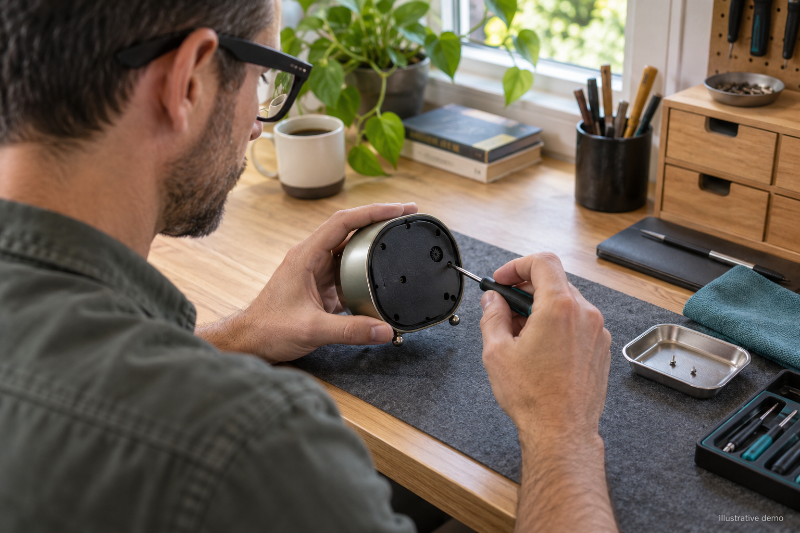
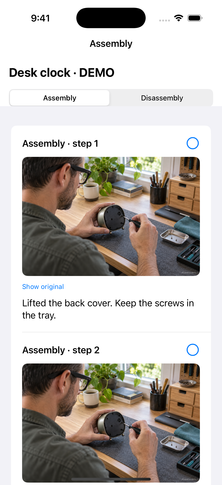
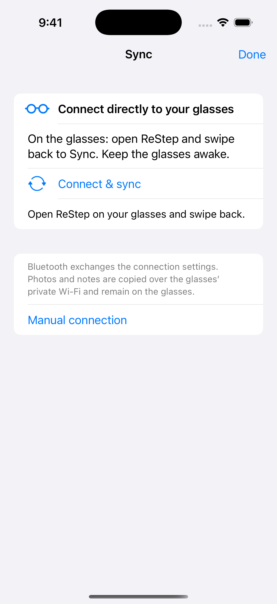
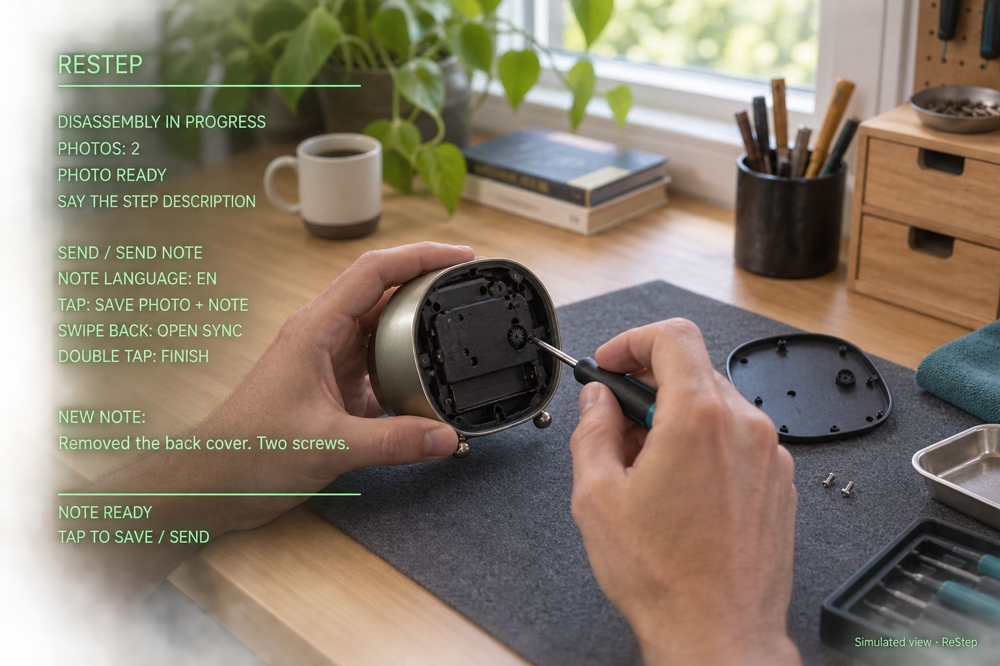

# ReStep — record the way back

**Your hands are busy. Record the repair with your voice.**

ReStep is a DIY app for Rokid RG-glasses and companion apps for iPhone and Android. Say **Take photo**, describe the step, then say **Send** or **Send note**. The glasses save the photo and note together, so you can keep holding the part and tools. After syncing to your phone, follow the steps in reverse order to put everything back together.

[Download APKs and iPhone IPA](https://github.com/oldmelnick-afk/restep/releases) · [Project page](https://aleksandrmelnik.ru/craftcode#restep)

[Full project guide (PDF)](docs/ReStep-Project-Guide.pdf) - controls, setup, sync, screenshots and current limitations.

## Capture without using your hands

- Offline Russian and English voice commands: “сделать фото” / “take photo”, then “отправить” / “send” / “send note”. Pause briefly before the save command.
- One tap takes a photo; the next tap saves the description as an alternative to voice.
- Quiet waiting mode hides the full HUD after five seconds. During dictation the note stays visible.
- Saved steps survive restarts; continue the same session until a double tap finishes it. Another double tap exits. An unfinished, unsaved note can be lost on shutdown.
- Native 1600 × 1200 JPEG capture, with a short exposure warm-up.
- Swipe back to open sync. Phone transfer is a separate step; it is not voice-operated.

## Phone apps

Both companions keep an offline library, show assembly in reverse order, allow note/title edits and completion marks. Deleting a project queues deletion from the glasses at the next successful sync. Tombstones prevent deleted projects from returning during import. Save any pending photo before deleting its active session.

**iPhone 0.10:** install the unsigned IPA using Sideloadly or AltStore with your own Apple account. Standard build: Bluetooth discovers the connection settings; join the glasses Wi-Fi in Settings when prompted, then return to ReStep. This release does not include Auto Wi-Fi. Deployment target: see the Xcode project.

**Android phone 0.1 (preview):** Android 10+. Install `ReStep-Android-v0.1.apk` on the PHONE. Open Sync on the glasses, then Connect & sync on the phone. Grant nearby-device/location permissions and approve Android’s Wi-Fi request. Some phones also require Location services enabled for Wi-Fi discovery. Manual same-network IP/code sync is available as a fallback. The phone APK is separate from the glasses APK.

**Glasses 0.18:** install `restep-glasses-v0.18.apk` on the GLASSES via your existing ADB/sideload setup. This project does not modify firmware. Tested model: Rokid RG-glasses / Android 12; other models are untested.

## Privacy and scope

Photos and notes remain in local app storage. No account or cloud service is required for capture or transfer. Direct sync uses a WPA2 glasses network, encrypted Bluetooth settings and a fresh session token. Legacy manual transfer uses a six-digit code over your trusted local network. Uninstalling can remove local data.

Speech recognition currently supports Russian and US English with Vosk; it does not inherit every language available in Hi Rokid. Original notes are replayed in reverse step order; ReStep does not automatically rewrite them into repair instructions.

## Build

Install Android SDK 36.1 and Java 17+. Set `ANDROID_HOME` and `JAVA_HOME` (or use Android Studio). `./gradlew :phone:assembleDebug` builds the phone companion. For glasses, run `download-model.ps1` to download the official small RU/EN Vosk models, then `./gradlew :app:assembleDebug`. Model licenses are available at https://alphacephei.com/vosk/models.

On a Mac with Xcode, run `bash ios/build-unsigned-ipa.sh`. The iOS workflow also runs focused deletion checks. `ios/capture-demo.sh` builds an isolated simulator configuration with sample data for screenshots; this demo is excluded from normal builds.

## Verification and limitations

Glasses camera and controls have been exercised on physical RG-glasses. iPhone 0.10 was built on macOS and used by the owner. Android phone 0.1 builds and passes lint (warnings remain), launches in an Android emulator, and passes focused checks for persisted deletion, shared-photo retention, stale imports, edit preservation and connection-address validation. **Android Bluetooth pairing and direct Wi-Fi transfer still need testing on a physical phone.** Treat it as a preview, not a fully validated release. Voice accuracy depends on pronunciation and background noise; a tap is the fallback.

## Screenshots and illustrative media

The two phone images below are real iOS Simulator captures with synthetic demo data. Workshop and through-glasses scenes are AI-generated illustrations; the green overlay is a simulated view based on the app layout, not a physical camera recording.

 

Tags: Rokid · smart glasses · hands-free · repair · disassembly · reassembly · Android · iOS · Kotlin · SwiftUI · offline.
